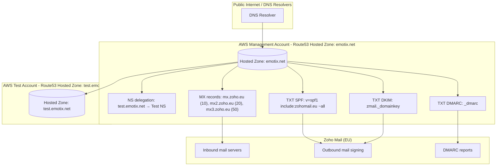

# Management DNS Stack — emotix.net

## Purpose

This document describes the Management DNS Stack responsible for the root domain `emotix.net`.

The stack acts as the single source of truth for DNS and is responsible for:

- Managing the root Route53 hosted zone
- Delegating subdomains to other AWS accounts
- Configuring Zoho Mail DNS records (MX, SPF, DKIM, DMARC)
- Enforcing email security best practices
- Preventing manual DNS drift via Infrastructure as Code (IaC)

All DNS records for `emotix.net` are managed exclusively via AWS CDK.

---

## Accounts & Responsibilities

| AWS Account | Responsibility |
|------------|----------------|
| Management Account | Owns `emotix.net` hosted zone and all root DNS records |
| Test Account | Owns `test.emotix.net` hosted zone |
| Prod Account | Will own production workloads and delegated DNS |

Only the Management account is allowed to modify root DNS and email-related records.

---

## High-Level Architecture

- `emotix.net` is hosted in the Management AWS account
- Subdomains (e.g. `test.emotix.net`) are delegated via NS records
- Each environment manages its own DNS independently
- Email security is enforced centrally at the root domain level

---

## DNS & Email Architecture Diagram



---

## Hosted Zones

### Root Hosted Zone — emotix.net

- AWS Account: Management
- Managed by: ManagementDnsStack

Contains:
- NS delegation records
- Email routing records
- Email authentication and security policies

---

### Delegated Hosted Zone — test.emotix.net

- AWS Account: Test
- Managed by: TestDnsStack

Delegation is implemented via NS records in the root zone.

---

## DNS Delegation Strategy

```
test.emotix.net → NS → name servers from the Test account
```

This provides:
- Clean multi-account separation
- Independent DNS lifecycle per environment
- Safe scalability to additional environments

---

## Email Provider Configuration

- Email provider: Zoho Mail (EU region)
- Zoho admin account: czzzech@gmail.com
- Primary mailbox: andrii@emotix.net

Zoho Mail relies entirely on DNS-based authentication.
All required DNS records are managed in this stack.

---

## Email DNS Records

### MX Records

```
MX 10 mx.zoho.eu
MX 20 mx2.zoho.eu
MX 50 mx3.zoho.eu
```

---

### SPF Record

```
v=spf1 include:zohomail.eu ~all
```

---

### DKIM Record

```
zmail._domainkey.emotix.net TXT
v=DKIM1; k=rsa; p=...
```

---

### DMARC Policy

```
v=DMARC1; p=none; pct=50; rua=mailto:dmarc@emotix.net; ruf=mailto:dmarc@emotix.net; sp=none; adkim=r; aspf=r
```

---

## Infrastructure as Code Principles

- No manual DNS changes
- Version-controlled DNS configuration
- Auditable and repeatable deployments
- Security-first email setup

---

## Summary

The Management DNS Stack is the backbone of the `emotix.net` domain.
